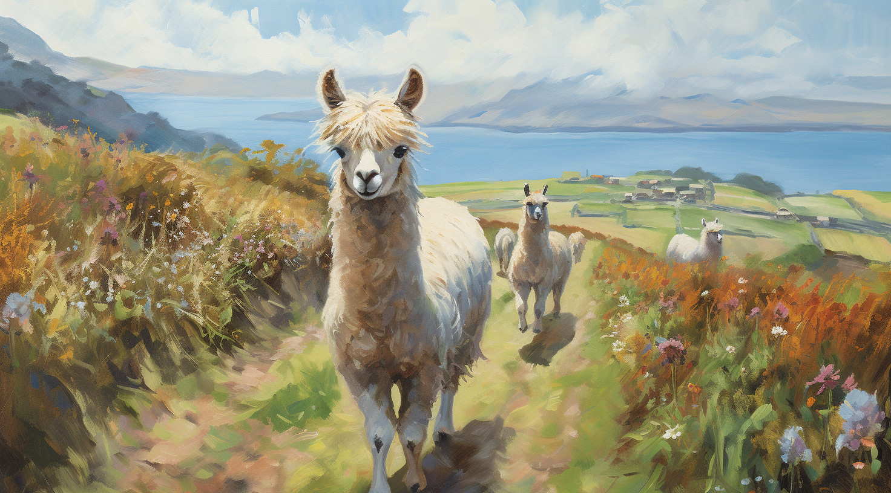
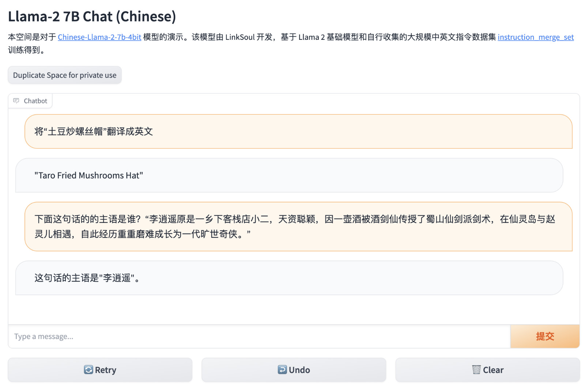

# Docker LLaMA2 Chat / 羊驼二代

<p style="text-align: center;">
  <a href="README_EN.md">ENGLISH</a> | <a href="README.md"  target="_blank">中文文档</a>
</p>

[](https://huggingface.co/meta-llama) [](https://huggingface.co/soulteary/Chinese-Llama-2-7b-4bit) [](https://huggingface.co/soulteary/Chinese-Llama-2-7b-ggml-q4) [](https://github.com/soulteary/docker-llama2-chat/blob/main/LICENSE)



Play! Together! **ONLY 3 STEPS!**

Get started quickly, locally using the 7B or 13B models, using Docker.

- Meta Llama2, tested by 4090, and costs 8~14GB vRAM.
- Chinese Llama2 quantified, tested by 4090, and costs 5GB vRAM.
- Use GGML(LLaMA.cpp), just use CPU play it.

## Preview





## Blogs

- [Use Docker to quickly get started with the official version of Llama2 Open-source Large Model](https://soulteary.com/2023/07/21/use-docker-to-quickly-get-started-with-the-official-version-of-llama2-open-source-large-model.html)
- [Use Docker to quickly get started with the chinese version of Llama2 Open-source Large Model](https://soulteary.com/2023/07/21/use-docker-to-quickly-get-started-with-the-chinese-version-of-llama2-open-source-large-model.html)
- [Quantizing MetaAI Llama2 chinese version large models using Transformers](https://soulteary.com/2023/07/22/quantizing-meta-ai-llama2-chinese-version-large-models-using-transformers.html)
- [Build Llama2 chinese large model that can run on CPU](https://soulteary.com/2023/07/23/build-llama2-chinese-large-model-that-can-run-on-cpu.html)


## Usage

1. Build LLaMA2 Docker image for 7B / 13B (official), 7B or 7B INT4 (chinese):

```bash
# 7B
bash run.sh 7b

# 13B
bash run.sh 13b

# 7B Chinese
bash run.sh 7b-cn

# 7B Chinese 4bit
bash run.sh 7b-cn-4bit
```

2. Download LLaMA2 Models from HuggingFace, or chinese models.

```bash
# MetaAI LLaMA2 Models (10~14GB vRAM)
git clone https://huggingface.co/meta-llama/Llama-2-7b-chat-hf
git clone https://huggingface.co/meta-llama/Llama-2-13b-chat-hf

mkdir meta-llama
mv Llama-2-7b-chat-hf meta-llama/
mv Llama-2-13b-chat-hf meta-llama/

# OR Chinese LLaMA2 (10~14GB vRAM)
git clone https://huggingface.co/LinkSoul/Chinese-Llama-2-7b

mkdir LinkSoul
mv Chinese-Llama-2-7b LinkSoul/

# OR Chinese LLaMA2 4BIT (5GB vRAM)
git clone https://huggingface.co/soulteary/Chinese-Llama-2-7b-4bit

mkdir soulteary
mv Chinese-Llama-2-7b-4bit soulteary/
```

keep the correct directory structure.

```bash
tree -L 2 meta-llama
soulteary
└── ...
LinkSoul
└── ...
meta-llama
├── Llama-2-13b-chat-hf
│   ├── added_tokens.json
│   ├── config.json
│   ├── generation_config.json
│   ├── LICENSE.txt
│   ├── model-00001-of-00003.safetensors
│   ├── model-00002-of-00003.safetensors
│   ├── model-00003-of-00003.safetensors
│   ├── model.safetensors.index.json
│   ├── pytorch_model-00001-of-00003.bin
│   ├── pytorch_model-00002-of-00003.bin
│   ├── pytorch_model-00003-of-00003.bin
│   ├── pytorch_model.bin.index.json
│   ├── README.md
│   ├── Responsible-Use-Guide.pdf
│   ├── special_tokens_map.json
│   ├── tokenizer_config.json
│   ├── tokenizer.model
│   └── USE_POLICY.md
└── Llama-2-7b-chat-hf
    ├── added_tokens.json
    ├── config.json
    ├── generation_config.json
    ├── LICENSE.txt
    ├── model-00001-of-00002.safetensors
    ├── model-00002-of-00002.safetensors
    ├── model.safetensors.index.json
    ├── models--meta-llama--Llama-2-7b-chat-hf
    ├── pytorch_model-00001-of-00003.bin
    ├── pytorch_model-00002-of-00003.bin
    ├── pytorch_model-00003-of-00003.bin
    ├── pytorch_model.bin.index.json
    ├── README.md
    ├── special_tokens_map.json
    ├── tokenizer_config.json
    ├── tokenizer.json
    ├── tokenizer.model
    └── USE_POLICY.md
```

3. Run Llama2 model in docker command:

```bash
# 7B
bash run.sh 7b
# 13B
bash run.sh 13b
# Chinese 7B
bash run.sh 7b-cn
# Chinese 7B 4BIT
bash run.sh 7b-cn-4bit
```

enjoy, open `http://localhost7860` or `http://ip:7860` and play with the LLaMA2!


## Credit

- MetaAI LLaMA2: https://ai.meta.com/llama/ ❤️
- Meta LLaMA2 7B Chat: https://huggingface.co/meta-llama/Llama-2-7b-chat
- Meta LLaMA2 13B Chat: https://huggingface.co/meta-llama/Llama-2-13b-chat
- Chinese LLaMA2 7B: https://huggingface.co/LinkSoul/Chinese-Llama-2-7b ❤️
- Chinese LLaMA2 7B GGML q4: https://huggingface.co/soulteary/Chinese-Llama-2-7b-ggml-q4
- LLaMA2 GGML Converter: https://hub.docker.com/r/soulteary/llama2
